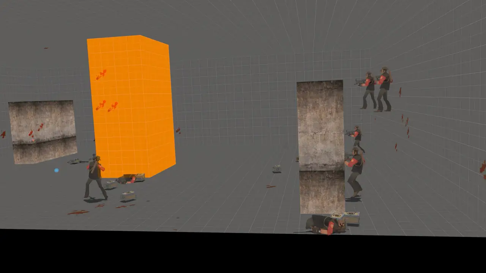

# jerry is a goat



<sub>[Full-quality video](public/jerryWideShot.webm)</sub>

<!-- The clip above is an animated WebP rather than a <video>: GitHub strips
     autoplay and loop from video tags in a README, even for uploaded videos,
     so an animated image is the only way to get it playing on its own. It's
     jerryWideShot.webm scaled to 1280px at 24fps (WebP quality 70) -- about 4.5 MB
     against 24-35 MB for a GIF of similar quality. -->

jerry is a sniper bot in tf2, trained with reinforcement learning using openAI's gymnasium  and stablebaseline3.


- **`python/toy_env/`** a 2d sim completely devoid of tf2, all simulation.

- **`src/game/server/tf/tf_sniper_bot.cpp`** the bridge that runs the trained
  network inside the TF2 server DLL: builds Jerry's observations, samples his
  actions 15 times a second, and aims analytically.
- **`src/game/server/tf/tf_sniper_policy_weights.h`** — the trained networks,
  exported into C++.
- **`game/mod_tf/`** the mod: the `1v1map` arena, a round manager, and configs.


---

*The rest of this readme is Valve's original Source SDK 2013 readme, kept because
it covers how to build the project.*

# Source SDK 2013

Source code for Source SDK 2013.

Contains the game code for Half-Life 2, HL2: DM and TF2.

**Now including Team Fortress 2! ✨**

## Build instructions

Clone the repository using the following command:

`git clone https://github.com/ValveSoftware/source-sdk-2013`

### Windows

Requirements:
 - Source SDK 2013 Multiplayer installed via Steam
 - Visual Studio 2022 with the following workload and components:
   - Desktop development with C++:
     - MSVC v143 - VS 2022 C++ x64/x86 build tools (Latest)
     - Windows 11 SDK (10.0.22621.0) or Windows 10 SDK (10.0.19041.1)
 - Python 3.13 or later

Inside the cloned directory, navigate to `src`, run:
```bat
createallprojects.bat
```
This will generate the Visual Studio project `everything.sln` which will be used to build your mod.

Then, on the menu bar, go to `Build > Build Solution`, and wait for everything to build.

You can then select the `Client (Mod Name)` project you wish to run, right click and select `Set as Startup Project` and hit the big green `> Local Windows Debugger` button on the tool bar in order to launch your mod.

The default launch options should be already filled in for the `Release` configuration.

### Linux

Requirements:
 - Source SDK 2013 Multiplayer installed via Steam
 - podman

Inside the cloned directory, navigate to `src`, run:
```bash
./buildallprojects
```

This will build all the projects related to the SDK and your mods automatically against the Steam Runtime.

You can then, in the root of the cloned directory, you can navigate to `game` and run your mod by launching the build launcher for your mod project, eg:
```bash
./mod_tf
```

*Mods that are distributed on Steam MUST be built against the Steam Runtime, which the above steps will automatically do for you.*

## Distributing your Mod

There is guidance on distributing your mod both on and off Steam available at the following link:

https://partner.steamgames.com/doc/sdk/uploading/distributing_source_engine

## Additional Resources

- [Valve Developer Wiki](https://developer.valvesoftware.com/wiki/Source_SDK_2013)

## License

The SDK is licensed to users on a non-commercial basis under the [SOURCE 1 SDK LICENSE](LICENSE), which is contained in the [LICENSE](LICENSE) file in the root of the repository.

For more information, see [Distributing your Mod](#markdown-header-distributing-your-mod).
